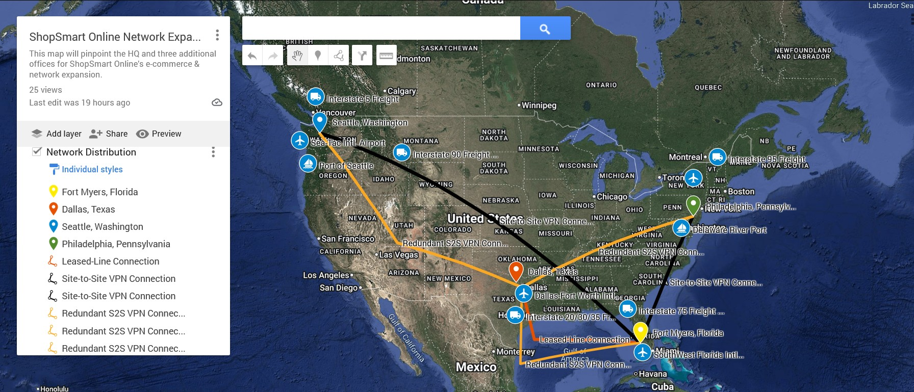
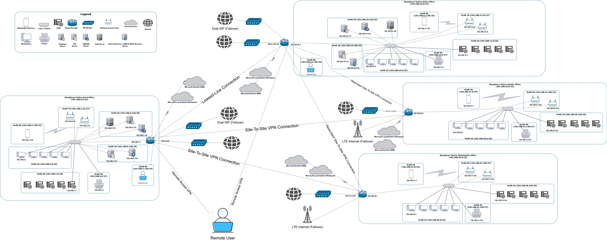

# ShopSmart Online — Multi-Site Enterprise Network Design

Architected a scalable WAN infrastructure for ShopSmart Online's e-commerce expansion, connecting a headquarters and three regional offices across the U.S. with redundant site-to-site VPN connectivity, dual ISP failover, and centralized security monitoring.

---

## Network Diagrams

### Geographic Topology

### Logical Network Architecture

---

## What Was Built

- Partial-mesh site-to-site IPSec VPN connecting Fort Myers (HQ), Dallas, Seattle, and Philadelphia
- Dual ISP failover at HQ and Warm site with LTE backup for branch sites
- VLAN segmentation across all locations for traffic isolation and security
- Microsoft Sentinel SIEM deployed at each site for centralized threat monitoring
- Cisco Meraki cloud-managed hardware across all four sites
- Centralized DHCP and DNS served from HQ with Dallas warm site as secondary
- Delivered full documentation suite including firewall rules, DHCP scopes, device lists, and VLAN breakdown

---

## Site Overview

| Site | Role | Network Block | VLANs |
|------|------|---------------|-------|
| Fort Myers, FL | Headquarters | 192.168.0.0/22 | 7 |
| Dallas, TX | Warm Site | 192.168.10.0/22 | 7 |
| Seattle, WA | Branch Office | 192.168.20.0/22 | 5 |
| Philadelphia, PA | Branch Office | 192.168.30.0/22 | 5 |

---

## Documentation

| Document | Description |
|----------|-------------|
| [Firewall Rules](docs/firewall-rules.md) | Inbound/outbound firewall rules per site and VLAN |
| [VLAN Breakdown](docs/vlan-breakdown.md) | VLAN IDs, subnets, and default gateways per site |
| [DHCP Scopes](docs/dhcp-scopes.md) | DHCP scope ranges and reservations per site |
| [Device List](docs/device-list.md) | Hardware and server inventory per site |
| [Contingency Planning](docs/continuity-and-recovery.md) | BCP, DRP, IRP, & SLAs |

---

## Technologies Used

- **Routing & Security:** Cisco Meraki MX (Router / Firewall / VPN Gateway / IDPS)
- **Switching:** Cisco Meraki MS
- **Wireless:** Cisco Meraki MR Access Points
- **VPN:** Partial-mesh, IPSec site-to-site full tunnel with dual ISP failover
- **Identity & Access:** Microsoft Active Directory, RADIUS Authentication
- **Security Monitoring:** Microsoft Sentinel SIEM, Snort IDPS
- **Services:** DNS, DHCP, VoIP, File Server, Database Server

---

*Senior Capstone — Information Systems Technology | 2025*
